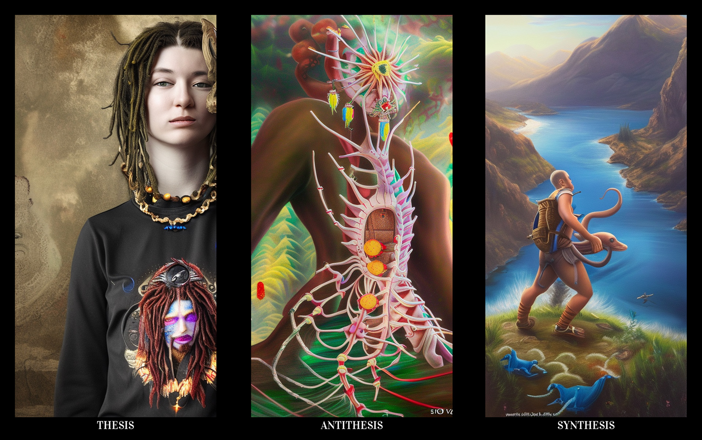

# Manticore





Digital divination using Stable Diffusion 2.1. It is quite imperfect, producing strange, ambiguous images.
We take 256 bits of entropy from the querent, expand them into random prompts, and generate three images: thesis, antithesis, and synthesis.
The thrill lies in the space of possibilities—roughly 10⁷⁷ initial states. The machine pulls a reading from a virtually inexhaustible realm of imagery, and the human interprets it.
Yet the future remains unpredictable; the issue runs deeper than mere divination.

Technomancy is divination using algorithms, random number generators, neural networks, and other forms of computational magic.
I appreciate this particular shift: whereas randomness used to be drawn from cards, dice, or coins, one can now take entropy and run it through an old generative model.
SD 2.1 excels thanks to its "imperfections": its flawed understanding of the world leads it to consistently produce strange, symbolic constructs that invite interpretation.


```bash
./scry
./scry "enough entropy to pass the gate"
```

Without an argument, scry accepts entropy immediately and loads the model at the same time.
Type any entropy and press Enter to start. A seed argument shorter than 256 bits is refused.

The default is three cards, 512×1024, 25 steps, written as one image at `outputs/YYYY-MM-DD-HHMMSS.png`, or `outputs/<name>.png` when `--out` is set.

`--video` runs each card to completion for 2 steps, then 3, and so on up to `--steps`. The one-step render is left out. Those finished images line up into one triptych per step count, so all three panels move together, then the video plays back to the start. `--video 24` sets the frame rate; the default is 10. The mp4 sits beside the png, or at `divination.mp4` inside a `--count` folder. Each card's renders stay in a `-frames` directory. This needs ffmpeg.
Generation shows the input entropy above one progress bar for all images.

By default cards are saved as one composite image. Pass `--count` to save them in a folder instead: three cards become `thesis.png`, `antithesis.png`, `synthesis.png`, and `divination.png`; any other count is `card_1.png`, `card_2.png`, and so on.

```bash
./scry "…" --count 3 --width 512 --height 1024 --steps 25 --out reading
```

The negative prompt is a line from `negative.txt`. One line is used as written. Several lines contribute one of them at random.

The first run creates `.venv`, installs dependencies, and downloads SD 2.1 if the weights are not already present.
